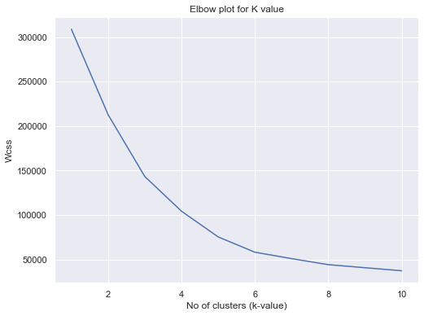
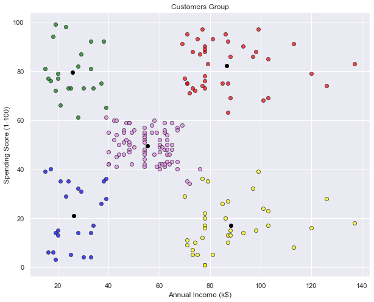
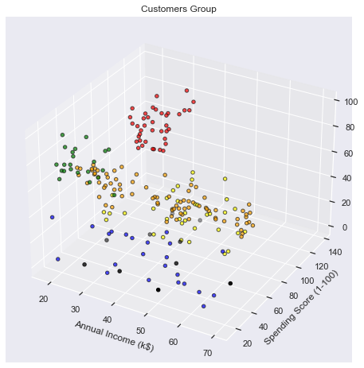

# Mall Customer Analysis Clustring
This is Clustring Project based on Mall customer data. 
Where we are trying to cluster them with there Annual income and Spending score in a Mall.

## Requirements
- Python3 / Anaconda3
- machine learning libraries installed

## Dataset
- [kaggle Dataset](https://www.kaggle.com/roshansharma/mall-customers-clustering-analysis)
- [Docker](https://www.docker.com/)

## Screenshots
### Elbow Graph to Predict the Right K Value

### Clusters With Two Features

### Clusters With Three Features

  

  
